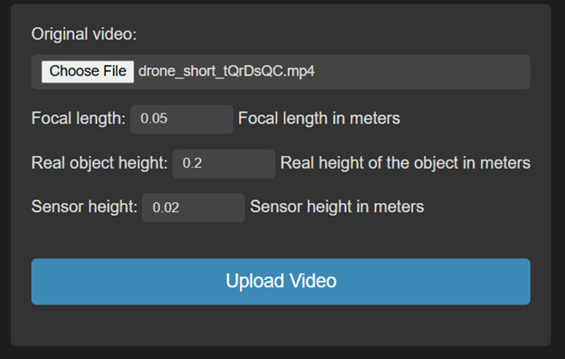

# Drone Detection Website

## Overview

This repository contains the implementation of a **Drone Detection System** that automatically detects drones in videos using deep learning and computer vision techniques. The project is built with **Django**, **TensorFlow**, and **OpenCV**, providing both a backend for processing videos and a frontend for visualizing results.

The system performs real-time object detection to identify drones within video frames and returns processed videos where the drones are highlighted. Additionally, users can upload videos and view processed results via a minimalistic and sleek black-themed web interface.

---

## Technologies Used

- **Django**: The web framework used to handle video uploads and interact with the system.
- **TensorFlow**: Deep learning library used for object detection, specifically with a custom-trained model.
- **OpenCV**: Open-source computer vision library used to handle video processing and visualization.

---

## Features

- **Video Upload**: Users can upload videos containing drone footage for analysis.
- **Drone Detection**: The system detects drones in the video using a pre-trained deep learning model.
- **Processed Video Output**: The program outputs a processed video with detected drones highlighted.
- **Web Interface**: Minimalistic and modern UI with a sleek black design for an enhanced user experience.

---

## Project Structure

- **Backend**: 
  - The backend handles video processing and object detection logic.
  - The `ObjectDetectionModel` is used to process each frame of the video and apply detection.
  
- **Frontend**:
  - The frontend provides an intuitive web interface where users can upload videos and view processed results.
  - It uses a simple but stylish black theme for a clean and modern look.

---

## Visuals

- **Picture 1**: Input data (video, focal length, real object height, sensor height)
  

- **Picture 2**: Interface for the results of the detection

- **Picture 3**: Processed video after detection, with drones highlighted

---

## Example Pages

1. **Main Page**: 
   The main page serves as the entry point of the application. Users can upload videos for drone detection, view processed results, and access other features like downloading the processed video.

2. **Drones Page**: 
   This page showcases a list of available drones with specifications, images, and technical details. It can serve as a reference page for users interested in learning more about the drones used in the system.

3. **Camera Page**: 
   The Camera page provides users with the option to explore different camera models used for drone detection. It lists the cameras' specifications, such as sensor type, resolution, and lens characteristics, along with images for each model. This page can be a valuable resource for those looking to understand how different cameras impact drone detection performance.
